# Otaku Hangman

An anime-themed hangman game for the desktop, written in Java with Swing. Guess anime techniques, characters, places and memes letter by letter, against a 30-second clock. The game has 10 levels, a scoring system with streak bonuses, and five otaku ranks to unlock.

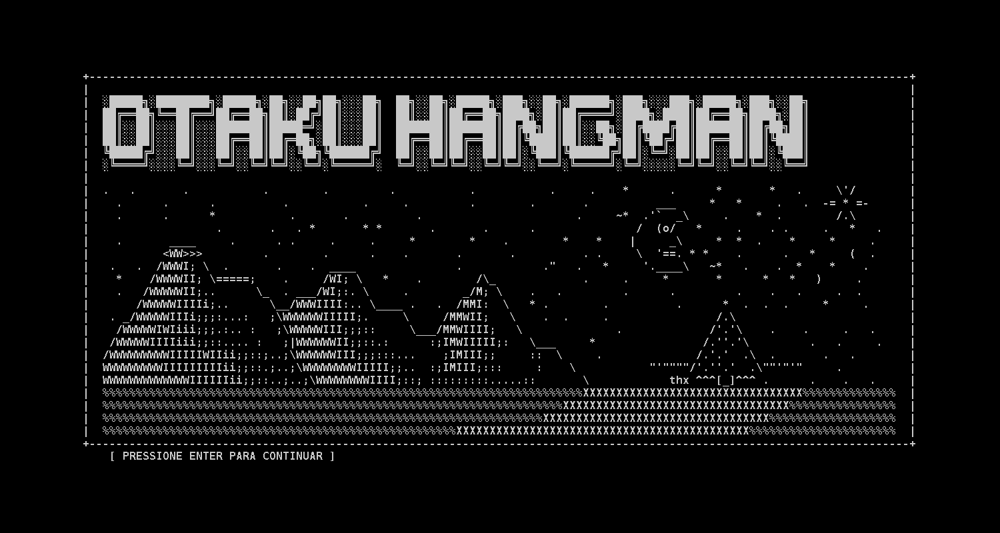

> The in-game text is in **Portuguese (pt-BR)**, the original audience of the game. Some HUD labels are in English.

---

## Table of contents

- [Features](#features)
- [Screenshots](#screenshots)
- [How to play](#how-to-play)
- [Rules](#rules)
- [Scoring and ranks](#scoring-and-ranks)
- [Levels](#levels)
- [Running the project](#running-the-project)
- [Project structure](#project-structure)
- [How it works](#how-it-works)
- [Known limitations and roadmap](#known-limitations-and-roadmap)

---

## Features

- **62 anime challenges** across **10 levels**, each with a humorous hint. They range from shonen classics to deep cuts.
- **Retro terminal look**: ASCII art, a starfield menu, CRT scanlines, glitch effects and neon glows, all drawn with Swing and Java2D.
- **Timed rounds**: every word has a 30-second clock, and the round ends on its own when time runs out.
- **Scoring system**: points depend on how many mistakes you make, and streak multipliers reward flawless runs.
- **Rank progression**: from *Otaku Iniciante* to *God Otaku*, with an animated rank-up screen.
- **Level gates**: levels 1–3 are learning levels you can always pass. From level 4 on you must meet the score and challenge requirements or retry the level.

---

## Screenshots

### Intro, story and main menu

| Onboarding | Main menu |
|:---:|:---:|
| 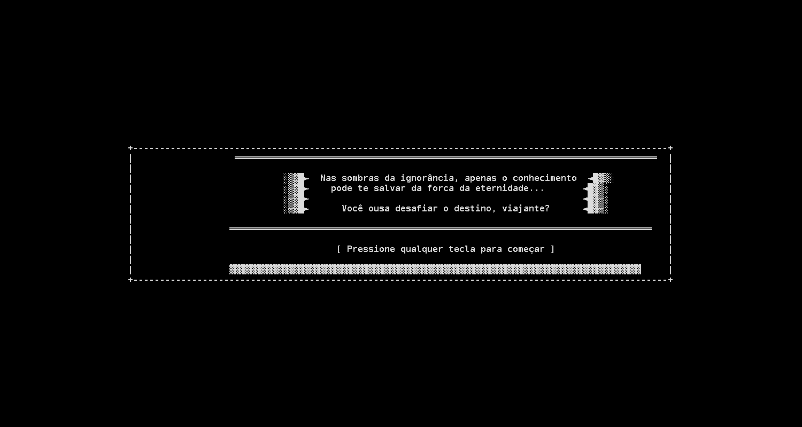 | 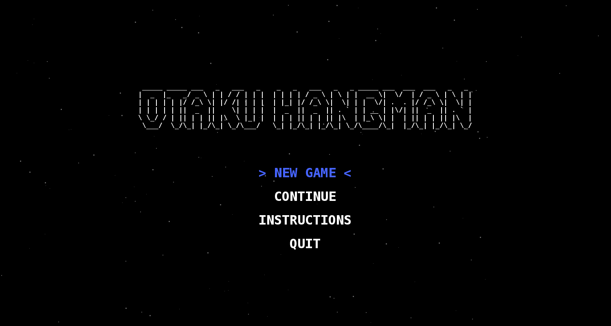 |

| Instructions | Name entry |
|:---:|:---:|
| 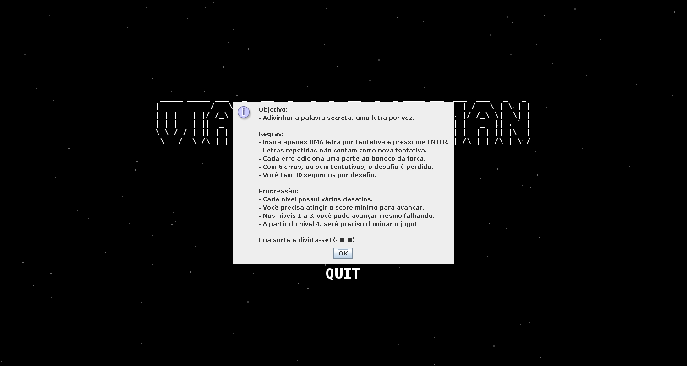 | 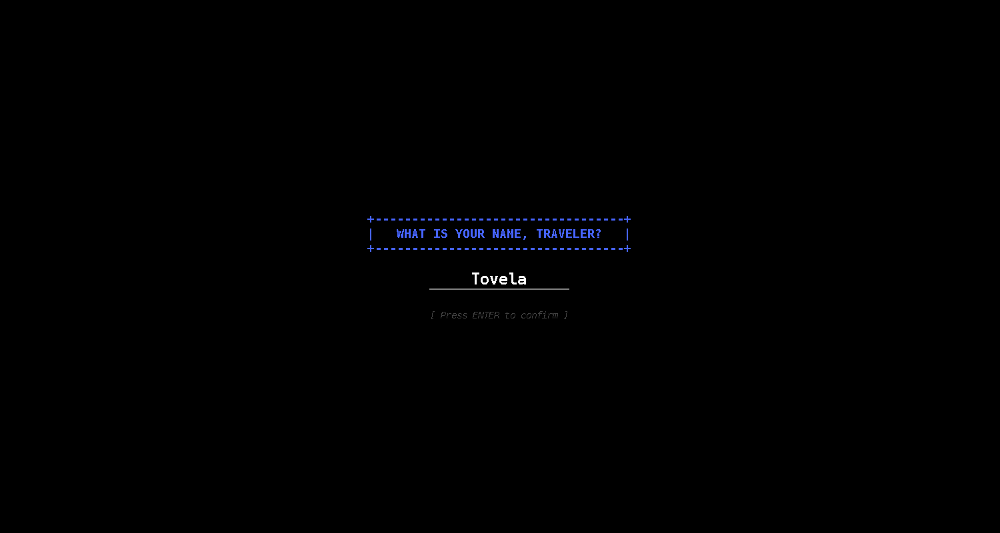 |

### Playing a challenge

The challenge screen shows:
- **HUD**: the level, the challenge number, your total score and the time left.
- **Middle**: the gallows on the left; the hint and the masked word on the right.
- **Bottom**: the letters you've tried, the input box, and how many mistakes you have left.

| Guessing | Making mistakes |
|:---:|:---:|
| 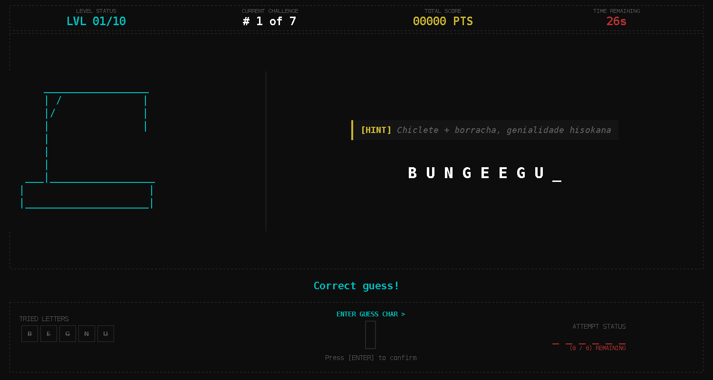 | 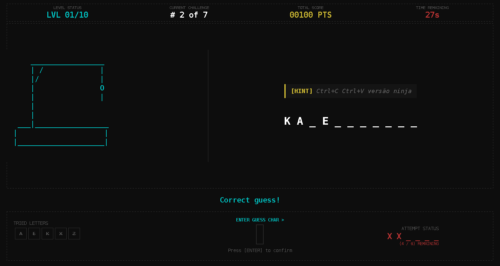 |

### End of a challenge

| Word guessed | Hangman complete | Time up |
|:---:|:---:|:---:|
| 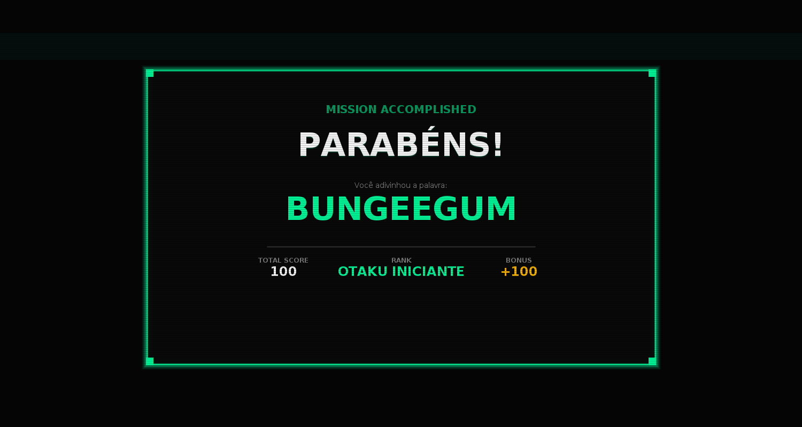 | 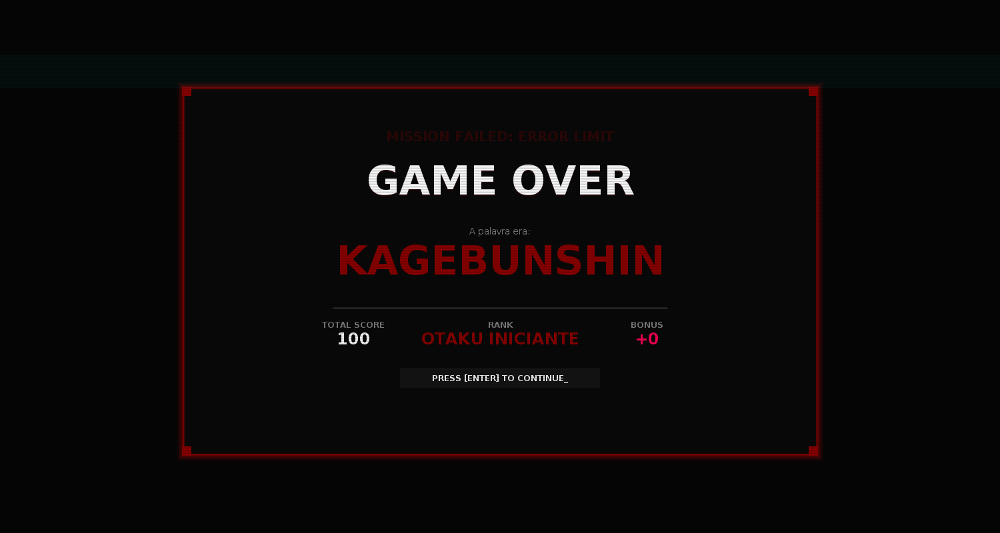 | 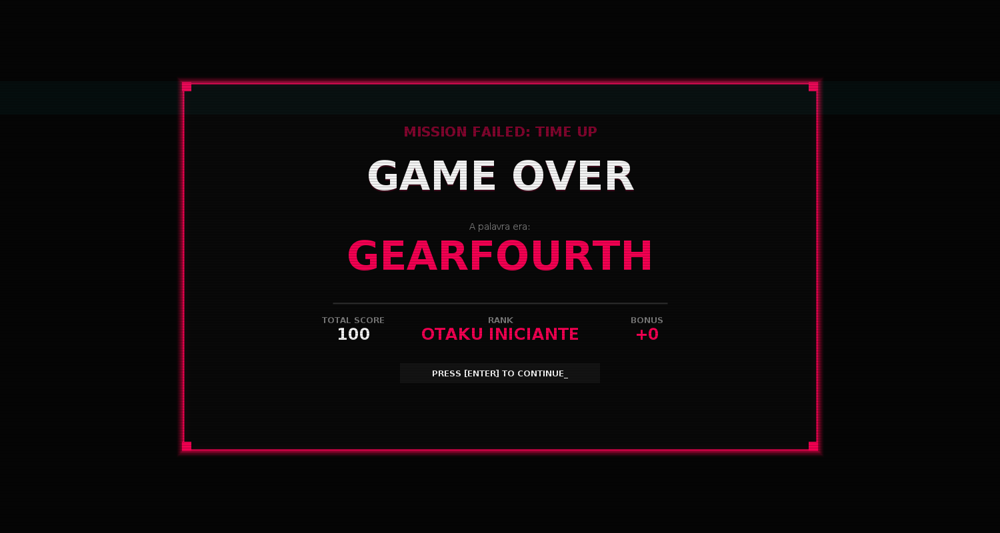 |

### Rank up

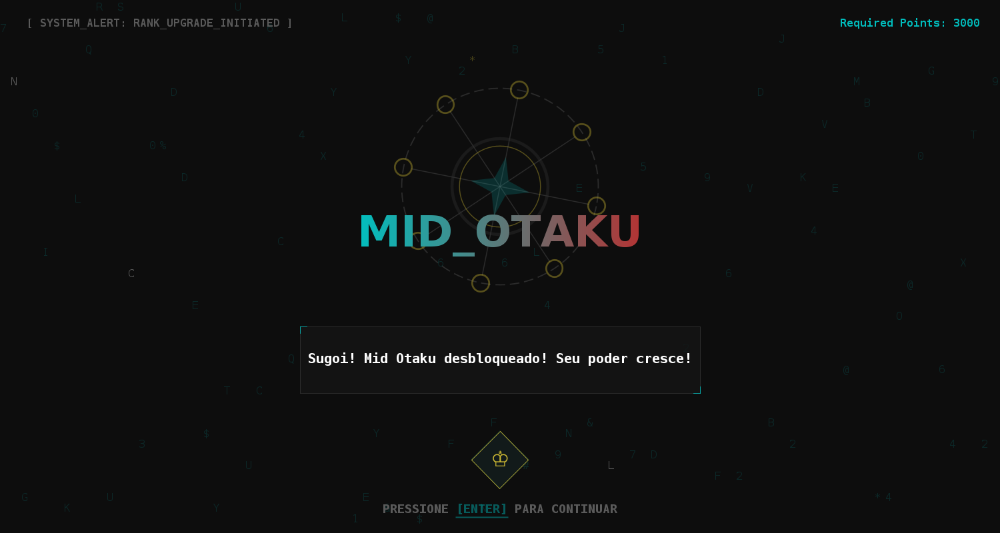

### End of a level

| Level passed | Learning level (levels 1–3) |
|:---:|:---:|
| 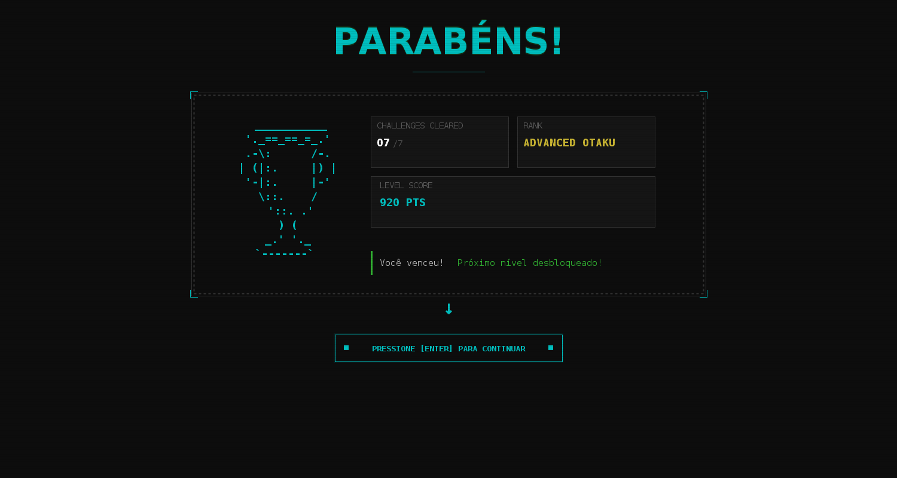 | 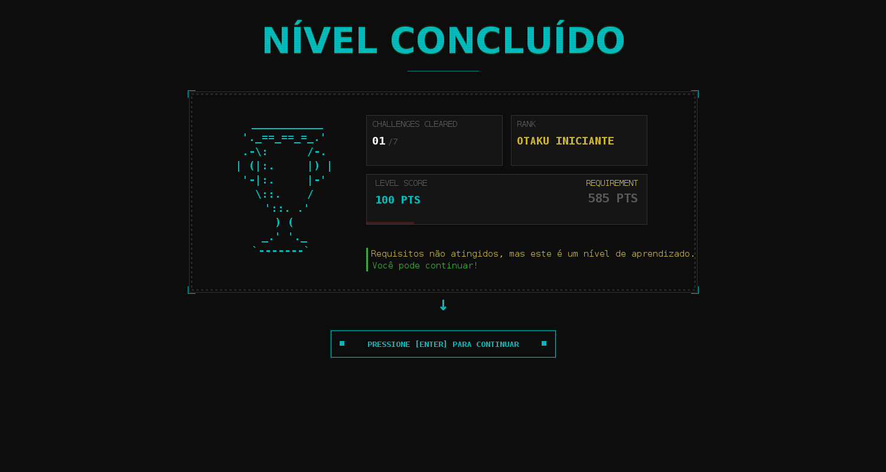 |

| Level failed (retry) | Game completed |
|:---:|:---:|
| 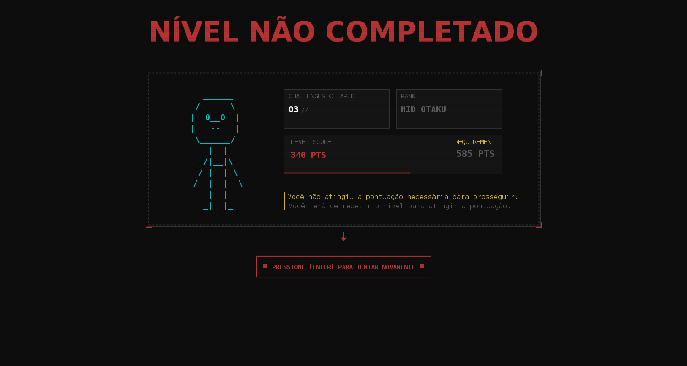 | 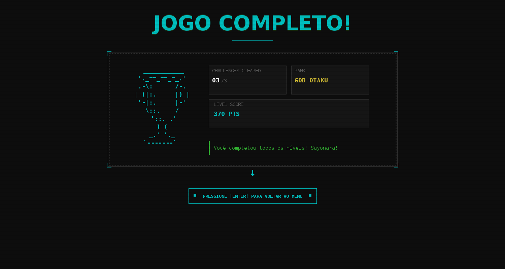 |

---

## How to play

1. Press **ENTER** on the intro screen, then any key to skip or continue the story.
2. Choose **NEW GAME** in the menu and type your player name. Press **ENTER** to confirm.
   - 2 to 20 characters: letters, numbers, spaces, `-` and `_`.
   - If you leave it empty, you get a random name like `Player_123`.
3. Read the **hint** and guess the hidden word. Type **one character** in the input box and press **ENTER**.
4. When the challenge ends, a result screen shows the word, the points you earned, your total score and your rank. Press **ENTER** to go on to the next challenge.
5. After the last challenge of a level, the level summary tells you whether you advance or have to retry.
6. Finish all 10 levels to complete the game.

---

## Rules

| Rule | Value |
|---|---|
| Characters per guess | 1 (letter or digit, case-insensitive) |
| Mistakes allowed | 6. The 6th wrong guess completes the hangman and loses the challenge. |
| Time per challenge | 30 seconds. The clock starts when the challenge screen appears. |
| Attempts per challenge | Word length + 2 |
| Repeated letters | Rejected and **free**: they don't cost an attempt or a mistake. |
| Spaces and symbols in a word | Revealed automatically |

A challenge ends in one of four ways:

| Outcome | When |
|---|---|
| **Won** | Every letter of the word has been revealed. |
| **Error limit** | You made 6 wrong guesses. |
| **Attempts limit** | You used all your attempts without revealing the word. |
| **Time up** | The 30 seconds ran out. |

---

## Scoring and ranks

### Points per challenge

You only score if you **win** the challenge. The base score depends on how many mistakes you made:

| Mistakes | 0 | 1 | 2 | 3 | 4 | 5 |
|---|---|---|---|---|---|---|
| **Base points** | 100 | 80 | 60 | 40 | 20 | 10 |

Losing a challenge scores 0 points.

### Streak multiplier

Winning a challenge with **zero mistakes** adds 1 to your streak. Any mistake, or a lost challenge, resets the streak to 0, and so does starting a new level. The streak you had *before* a challenge sets the multiplier for that challenge:

| Current streak | 0–1 | 2 | 3 | 4+ |
|---|---|---|---|---|
| **Multiplier** | ×1.0 | ×1.2 | ×1.5 | ×2.0 |

For example, five flawless wins in a row score `100 + 100 + 120 + 150 + 200 = 670` points.

### Ranks

Your rank is based on your **total points across the whole game**. Reaching a new rank opens the rank-up screen.

| Rank | Total points |
|---|---|
| Otaku Iniciante | 0 |
| Otaku Nutella | 1,000 |
| Mid Otaku | 3,000 |
| Advanced Otaku | 5,000 |
| God Otaku | 9,500 |

---

## Levels

To **pass** a level you need both of the following:

- **Challenges won:** at least 75% of the level's challenges, rounded up.
- **Level score:** at least 50% of the level's reference score. Each challenge has a reference value: 100 for the 1st, 120 for the 2nd, 150 for the 3rd and 200 for each one after that.

| Level | Theme | Challenges | To pass | Type |
|:---:|---|:---:|---|---|
| 1 | Shonen techniques and power-ups | 7 | 6 won, 585 pts | Learning level |
| 2 | Powers, bloodlines and transformations | 7 | 6 won, 585 pts | Learning level |
| 3 | Legendary battle cries, weapons and apocalypses | 7 | 6 won, 585 pts | Learning level |
| 4 | Worlds, artifacts and anime tropes | 7 | 6 won, 585 pts | Mastery required |
| 5 | Isekai heroes and shonen icons | 7 | 6 won, 585 pts | Mastery required |
| 6 | Characters, gods and detectives | 7 | 6 won, 585 pts | Mastery required |
| 7 | Cult classics and 90s/2000s gems | 7 | 6 won, 585 pts | Mastery required |
| 8 | Villains, masterminds and deep cuts | 7 | 6 won, 585 pts | Mastery required |
| 9 | Bonus round: legendary series | 3 | 3 won, 185 pts | Mastery required |
| 10 | Final exam | 3 | 3 won, 185 pts | Mastery required |

**Learning levels (1–3):** if you miss the requirements you still move on to the next level, so new players can get used to the game.

**Mastery levels (4–10):** if you miss the requirements you **replay the level**. Your level score, challenge count and streak start again from zero, but your total points and rank are kept.

After level 10, the game shows a **"Jogo Completo!"** screen and takes you back to the main menu.

> Spoiler-free on purpose: the words themselves live in [`GameData.java`](src/main/com/otakuhangman/core/GameData.java).

---

## Running the project

### Requirements

- **JDK 17 or newer.** The project is configured for **JDK 21**, and the code uses records, text blocks and switch expressions.
- No external libraries and no build tool. It's plain Java SE plus Swing.

### Option 1: IntelliJ IDEA (recommended)

1. Clone the repository:
   ```bash
   git clone https://github.com/thove22/otakuHangmanGame.git
   ```
2. Open the folder in IntelliJ IDEA.
3. If you see **"JDK 21 is missing"**, click **Choose JDK to download…** and pick version 21 from any vendor (for example Eclipse Temurin). You can also select a JDK you already have under *File → Project Structure → Project → SDK*.
4. Open `src/main/com/otakuhangman/core/Main.java` and click the green ▶ next to `main`.

### Option 2: command line

From the project root:

**macOS / Linux**
```bash
javac -encoding UTF-8 -d out $(find src -name "*.java")
java -cp out main.com.otakuhangman.core.Main
```

**Windows (PowerShell)**
```powershell
javac -encoding UTF-8 -d out (Get-ChildItem -Recurse src -Filter *.java).FullName
java -cp out main.com.otakuhangman.core.Main
```

> `-encoding UTF-8` matters on Windows. Without it, the accents and ASCII art in the Portuguese text can come out garbled.

The game opens in a 1000×700 window. You can resize or maximize it.

---

## Project structure

```
src/main/com/otakuhangman/
├── core/                      # Game rules (no UI code)
│   ├── Main.java              # Entry point – opens the Swing window
│   ├── Challenge.java         # One word: guesses, mistakes, attempts, timer, end reason
│   ├── Level.java             # A set of challenges + pass requirements
│   ├── Player.java            # Score, streak, completed challenges, rank
│   ├── GameData.java          # All 10 levels and their words/hints
│   ├── ScoreCalculator.java   # Base points × streak multiplier
│   ├── ScoreBase.java         # Mistakes → base points table
│   ├── Rank.java              # Rank thresholds
│   ├── AttemptResult.java     # CORRECT, WRONG, REPEATED, TIME_UP, ...
│   ├── EndChallengeReason.java# WON, ERROR_LIMIT, ATTEMPS_LIMIT, TIME_UP
│   ├── HangmanArt.java        # The 7 gallows stages
│   └── Game.java              # Legacy console version of the game loop
├── controller/                # Bridge between rules and UI
│   ├── GameSessionController.java  # Runs a game session (start, guess, resolve, advance)
│   ├── ChallengeViewState.java     # Snapshot of a challenge for the UI
│   ├── ChallengeResolution.java    # Result of a finished challenge
│   ├── LevelResolution.java        # Result of a finished level
│   └── LevelProgressState.java     # ADVANCED, ISFORGIVING, RETRY, GAME_COMPLETED
└── gui/                       # Swing user interface
    ├── AppCordinator.java     # Wires the screens together and drives the game flow
    ├── ScreenManager.java     # CardLayout-based screen switching with onEnter/onExit hooks
    ├── Screen.java            # Base class for every screen
    ├── screens/               # Intro, OnBoarding, Menu, NameEntry, Challenge,
    │                          # EndChallenge, RankAchieved, LevelResult
    └── utils/                 # ASCII art and the starfield animation
```

---

## How it works

The code is split into three layers, and each layer only talks to the one below it:

```
 gui (Swing screens)  ──▶  controller (GameSessionController)  ──▶  core (rules)
```

- **`core`** has the game rules and no UI code. `Challenge` tracks one word. It doesn't store a separate "game over" flag: it works out from its current state whether the round was won, ran out of time, or hit the mistake or attempt limit. `Player` accumulates points with `ScoreCalculator` and updates its `Rank`. `Level` works out its own pass requirements from how many challenges it has.
- **`controller`** has `GameSessionController`, which runs a session: it starts a game, submits guesses, scores each finished challenge exactly once, and moves to the next challenge or level. The UI never touches `core` objects directly. It gets read-only snapshots as Java records (`ChallengeViewState`, `ChallengeResolution`, `LevelResolution`).
- **`gui`**: `ScreenManager` switches between screens with a `CardLayout` and calls each screen's `onEnter`/`onExit`, which start and stop its animation timers. `AppCordinator` decides which screen comes next:

```
Intro → OnBoarding → Menu → NameEntry → Challenge → EndChallenge
                                            ▲              │
                                            │              ├─ rank went up?        → RankAchieved
                                            │              ├─ more challenges left → next Challenge
                                            │              └─ level finished       → LevelResult
                                            │                                          │
                                            └─────── next level / retry ◀──────────────┤
                                                     after level 10      → back to Menu
```

The challenge screen refreshes every 300 ms so the timer and HUD stay current. When a challenge ends, by a guess or by the clock, it shows the outcome for 1.5 seconds and then moves to the result screen.

---

## Known limitations and roadmap

- **Continue** in the main menu isn't implemented yet. Progress isn't saved between runs.
- `core/Game.java` is the original **console version** of the game loop. The GUI no longer uses it.
- `Challenge` supports an **"ordered" mode**, where letters must be guessed in order, but no level uses it yet.
- Levels 9 and 10 have only 3 challenges each and could be extended.
- There are no automated tests and no build tool (Maven/Gradle) yet.

---

Made with ☕ and too many hours of anime by [@thove22](https://github.com/thove22).
